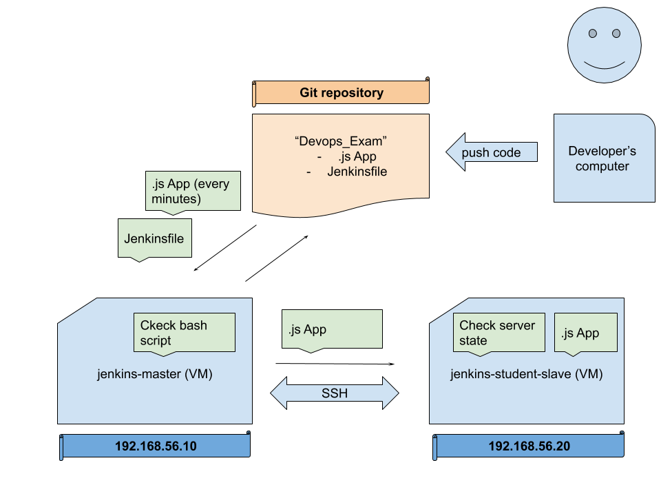

# README file for project: *DevOps Exam*

## Goal of the project
- To build an automatic test enviroment for a deveopler, developing a NodeJs server.

See System Overview below

## Infrastructure of the project
- Server for running Jenkins VM, running CentOS 7, (named: jenkins-master), Master
- Server for running NodeJs VM, running CentOS 7, (named: jenkins-student-slave), Slave
- GitHub project (named: DevOps Exam)
- A computer, where the Developer Works. (It can run any operation system, such as MS Windos, Linus, Mac OS)

## The project is succefull if
- The developer changes the program code, and pushes to the GitHub repository.
- After that (~ 1-1,5 min later) the changed code should be running on the NodeJs server.
- If any error occurs, the system has to present a human readeble error message.

## Content of GitHub repository (file list)
- image.png (System Overview Diagram)
- index.js (NodeJs file, will be deployed, runs the NodJs server)
- Jenkinsfile (instructions for the Jenkins server)
- node.sh (Bash script, for deploying index.js)
- README.md (this file)
- test_server.sh (Bash script, testing the server state)
- test_test_server.sh (Bash script, testing the server testing script)
- test.sh (will be not used, test file during development)
- ToDos.txt (the raw instuctios of this README.md document)

# Instructions, setting up the *whole System*

# Prepare *Jenkins* VM

## Set IP Addpress to:
~~~
192.168.56.10
~~~

## Set Hostname to *jenkins-master*
~~~bash
hostnamectl set-hostname jenkins-master
~~~

## Instal Shellcheck
~~~bash
yum -y install epel-release
yum install ShellCheck -y
~~~

##  Install Git
~~~bash
yum install git
~~~

## Install Java
~~~bash
yum install java-1.8.0-openjdk-devel -y
~~~

## Install Jenkins
~~~bash
curl --silent --location http://pkg.jenkins-ci.org/redhat-stable/jenkins.repo | sudo tee /etc/yum.repos.d/jenkins.repo
rpm --import https://jenkins-ci.org/redhat/jenkins-ci.org.key
yum install jenkins -y
~~~

## Start Jenkins
~~~bash
systemctl start jenkins
systemctl status jenkins
systemctl enable jenkins
~~~

## Check Jenkins
~~~bash
ss -tpln | grep java
~~~
(Hint: Port number: 8080)

## Set firewall
~~~bash
firewall-cmd --add-port=8080/tcp --permanent
firewall-cmd --reload
~~~

## Start browser
192.168.56.10:8080  
cat password  
install plugins  
set admin: admin / 000000  

# Prepare *Slave* VM

## Set IP Address to
~~~
192.168.56.20
~~~

## Set Hostname to *jenkins-student-slave*
~~~bash
hostnamectl set-hostname jenkins-student-slave
~~~

## Install Git
~~~bash
yum install git -y
~~~

## Set firewall
~~~bash
firewall-cmd --add-port=6453/tcp --permanent
firewall-cmd --reload
~~~

## Install NodeJs
~~~bash
curl -sL https://rpm.nodesource.com/setup_10.x | sudo -E bash -
yum install gcc-c++ make nodejs -y
yum install -y nodejs
~~~

## Edit sudoers
~~~bash
sudo visudo
~~~
  append line:  
~~~
jenkins ALL=(ALL) NOPASSWD:ALL
~~~

# Create Jenkins Agent
## Do this steps on your *Slave* VM

## Install Java
~~~bash
yum install java-1.8.0-openjdk-devel -y
~~~

## Create user: Jenkins
~~~bash
useradd -d /var/lib/jenkins jenkins
passwd jenkins
~~~

## Create SSH key for user Jenkins
~~~bash
su - jenkins
ssh-keygen -t rsa -C "Jenkins Agent SSH key"
~~~

## Work with SSH key
~~~bash
cat ~/.ssh/id_rsa.pub >> ~/.ssh/authorized_keys
chmod 600 ~/.ssh/authorized_keys
~~~

Hint: Copy the PRIVATE Key to your Host Machine (win, linux, mac)  

## Do this on the *Jenkins* GUI
### Add new Node
Main Menu > Magane Jenkins >  Manage Nodes >   
1.)  
  - name: jankins-Slave  
  - type: Pemanent Agent  

2.)  
  - Description: My .... Jenkins Slave  
  - Remote dir: /var/lib/jenkins  
  - Lable: slave  
  - Launch: via SSH  
  - Host: 192.168.56.20   
  
Credentials:  
  - Domain: Global  
  - Kind: SSH user with key  
  - Scope: Global  
  - ID: jenkins_slave_ssh  
  - Desc: SSSH Key for jenkins slave  
  - Username: jenkins  
  - PKey: Enter directly (hint: paste private key)  

  - Host Key Ver Strat: No verif....  

### Add new Node
Connect to Git repo  

- At the Project (type: pipeline):  
- Pipeline: Pip. script from SCM  
- SCM: git  
- Repositories:  
- Url: https://github.com/sferentzi/DevOps_Exam
- Cred:  
- Domain: Global  
- Kind: U & passwd  
- Scope: Global  
- User: git  
- ID: sferentzi_git  
- Dec: git to repo  

### Important setting
- set Poll SCM: * * * * *  